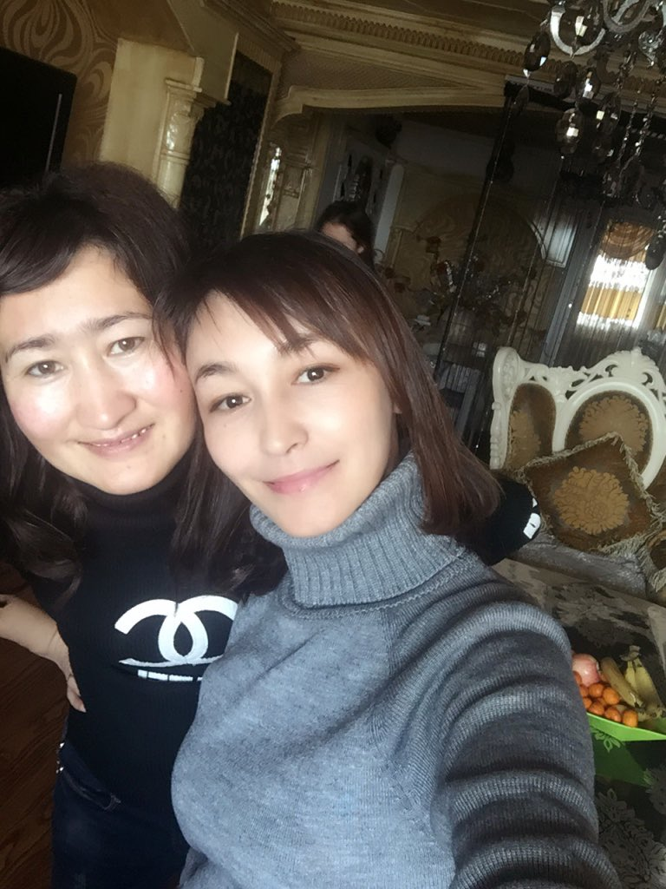

# #FreeRenagul

Free Renagul Gheni, mother of 2, sister of Kalbinur Gheni.

Read her [story](BookOfRenagul/BookOfRenagul.pdf) ([magyarul](BookOfRenagul/BookOfRenagul_hu.pdf)) 

Check the campaigns: 
* [Social media campaign](SocialMediaCampaign/SocialMediaCampaign.md) 
* [Hungarian email campaing](HungarianCampaign)
  1. Email to [China's Hungary consulate](HungarianCampaign/1_ChinaHungaryConsulate)
  2. Email to [Hungary's China consulate](HungarianCampaign/2_HungaryChinaConsulate)
  3. Email to [Hungarian Foreign Minister](HungarianCampaign/3_HungarianForeignMinister)
* Interview with her sister (mp3): [Kalbinur_Gheni_20210131.mp3](https://github.com/Stop-Uyghur-Genocide/FreeRenagul/blob/main/Interview/Kalbinur_Gheni_20210131.mp3?raw=true) (sound quality is unfortunately very weak, this was my first interview ever and did not know nothing about echo)

Follow her sister on Twitter: https://twitter.com/Qelbinur10
